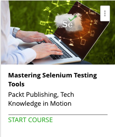

```
Roberto Nogueira  
BSd EE, MSd CE
Solution Integrator Experienced - Certified by Ericsson
```
# Udemy Mastering Selenium Testing Tools



**About **

Learn everything you need to about the subject of this `Udemy` project.

[Homepage](https://www.udemy.com/mastering-selenium-testing-tools)

## Topics
```
Section: 1
0 / 4
Setting Up the Work Environment
[ ]1. The Course Overview 3:33
[ ]2. Selenium Tools Suite 2:26
[ ]3. Preparing Your Environment 5:39
[ ]4. Inspecting the Web Elements 4:36

Section: 2
0 / 3
Selenium IDE
[ ] 5. A Quick Introduction to Selenium IDE 3:04
[ ] 6. Putting the Selenium IDE to Use 3:29
[ ] 7. Getting to Know the Selenium IDE Better 9:33

Section: 3
0 / 9
Selenium WebDriver
[ ] 8. Introducing WebDriver 9:32
[ ] 9. Implementing Our First Example 9:07
[ ] 10. WebDriver Capabilities 2:34
[ ] 11. The WebDriver API 3:49
[ ] 12. Locators 5:51
[ ] 13. WebElement 5:23
[ ] 14. Page Objects 9:14
[ ] 15. Advanced WebDriver 20:05
[ ] 16. Build with a Build System 17:46

Section: 4
0 / 4
Behavior-driven Development
[ ] 17. Business Facing 5:45
[ ] 18. An Example - Infrastructure 3:36
[ ] 19. Actual Cucumber Implementation 9:18
[ ] 20. Maintainability and Organization of the Code 2:41

Section: 5
0 / 3
Selenium Server
[ ] 21. Introduction to the Selenium Server 7:20
[ ] 22. Running Tests on the Selenium Server Internally 5:59
[ ] 23. Running Tests on the Selenium Server Externally 5:41

Section: 6
0 / 4
A Complete Example
[ ] 24. Setting Up the Project 6:37
[ ] 25. Implementation of the Project 5:07
[ ] 26. Continuous Integration 11:50
[ ] 27. Implementing Tests for the Web Application 8:07

Section: 7
0 / 2
Implementing Tests for the Web Application
[ ] 28. Advanced Usage of Selenium 7:32
[ ] 29. A Look Back 6:48
```
